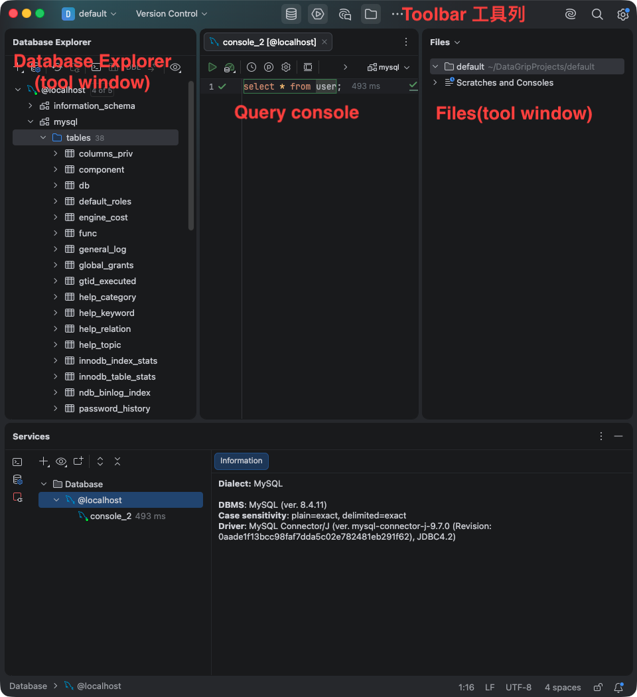

# DataGrip 介面導覽

這張圖把 DataGrip 常用的工作區分成四個區域：

- **Database Explorer**：查看資料來源、資料庫、schema、資料表與其他資料庫物件的樹狀結構。
- **Query console**：撰寫與執行 SQL 查詢的主要編輯區。
- **Files**：瀏覽專案中的 SQL 檔、設定檔與其他檔案。
- **Tool Window**：開啟或切換輔助視窗的側邊工具列；例如 Database Explorer、Services 與 Files。

官方介面導覽指出，Database Explorer 與 Files 都是 tool window；預設時 tool windows 會停駐在主視窗的側邊或底部，可調整大小、移動或隱藏。

參考資料：[JetBrains DataGrip — User interface](https://www.jetbrains.com/help/datagrip/guided-tour-around-the-user-interface.html)（存取日期：2026-08-19）。
